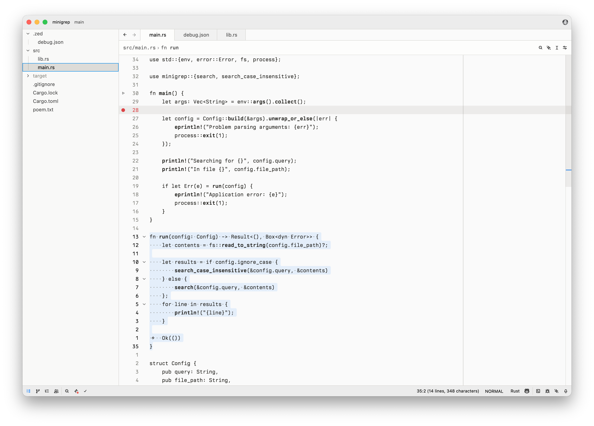
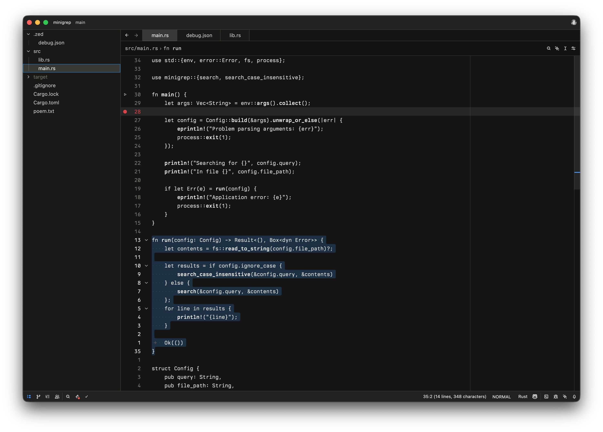

# zed-emerald-theme

Minimal Zed theme focused on typography.





## Prerequisites
- Install the `veneer-theme` CLI used to build the theme assets:
  ```sh
  cargo install --git https://github.com/ascarter/veneer-theme
  ```
- Install `just` for running the task recipes:
  ```sh
  brew install just
  ```

## Build
- Generate the compiled theme files:
  ```sh
  just build
  ```
The output ends up in `themes/` and can be linked or copied into your Zed config.

The theme can be installed as an extension in Zed.

## Justfile tasks
- `just build` (default): Create `themes/emerald.json` from `src/emerald.json.tera` using `veneer`.
- `just clean`: Remove the generated `themes/` directory.
